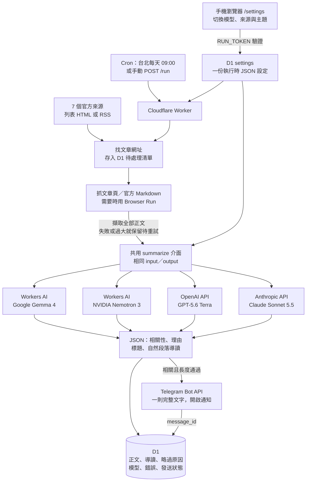

# TechNews 新版架構

這份文件描述目前 Worker 的架構。部署後，手機設定頁位於 `https://<你的 Worker 網址>/settings`。
本頁的流程圖描述既有部落格 digest；新增的 X 收藏學習流程見 [實作計畫](plans/x-learning.md) 與 [設定說明](learning-setup.md)，預設尚未啟用。
說明採用 [SimpleEnglish](https://github.com/AminBlg/SimpleEnglish/blob/main/skills/simple-english/SKILL.md) 的短句與明確主詞原則。

每篇文章只使用選中的一個模型。圖中的四個模型代表切換選項，不是每篇呼叫四次。
Gemma 4 是預設值。模型失敗時不會自動切換到付費 API。

| 平台 | 責任 | Input | Output |
| --- | --- | --- | --- |
| 官方網站 | 提供文章入口與原文 | HTTP GET | RSS、HTML 或 Markdown |
| Worker | 排程、取正文、排隊、呼叫模型、檢查格式、發訊息 | 設定、網址、文章與處理狀態 | 模型請求、D1 更新、Telegram 文字 |
| Browser Run | 直接請求失敗時取得渲染後 HTML | 原文網址 | HTML；不保證能通過網站的防機器人措施 |
| Workers AI | 執行 Gemma 或 Nemotron | 編輯指令＋一篇全文＋關注主題 | 導讀 JSON |
| OpenAI／Anthropic API | 提供可切換的付費摘要模型 | 同樣的文章資料與編輯規則 | 相同導讀欄位 |
| D1 | 保存設定、全文與執行進度 | SQL 寫入 | 設定、待處理文章與稽核資料 |
| Telegram | 顯示一篇完整導讀 | 文字、chat ID、通知設定 | 頻道訊息與訊息 ID |

模型收到的資料包含來源、標題、日期、網址、全部擷取正文與讀者主題。程式要求模型先讀完正文再整理。
程式不再把 Apple RSS description 當全文，也不再截取正文前 20,000 字元。
claude.dev 使用官方 Markdown。其他來源擷取文章頁的正文、程式碼文字、表格文字與連結。
超過 150,000 字串單位的文章會報錯並留待重試，不會偷偷截斷。

「全文」指本次擷取的文章正文。圖片像素、影片、下載檔、互動圖表、付費內容與外連文件不會自動傳給模型。
程式不能證明網站沒有隱藏、分頁或動態載入的內容，也不能保證模型每個細節都理解正確。
需要完整處理這些資料時，須另加擷取方式。

模型不會讀到 Bot token、chat ID、RUN_TOKEN 或其他文章歷史。
設定頁只顯示 API Secret 是否存在，不會回傳金鑰。
模型回傳欄位如下：

| 欄位 | 用途 |
| --- | --- |
| `publish` | 是否符合讀者主題 |
| `reason` | 保存在 D1 的判斷理由 |
| `title_zh` | 繁中標題 |
| `body_zh` | 依文章內容組成的自然段落導讀 |

導讀優先保留具體機制、例子、操作方式、限制與取捨。
格式不再固定成摘要、五點清單、iOS 推論與關鍵字。
每則訊息含來源、日期與原文連結。正文可用篇幅扣除這些資料後計算。
超過 Telegram 4,096 字串單位時，模型會重新編輯一次。仍超長時保留錯誤，不截掉導讀尾端。

`settings` 的 JSON 是唯一的遠端使用者設定。`wrangler.jsonc` 提供首次啟用的預設值與執行上限。
每次 Cron、`/run` 或 `/preview` 都讀取 D1，因此儲存模型選項後不需要重部署。
已產生但尚未送出的導讀會重用原模型結果；切換模型主要影響下一篇尚未生成的文章。

| 介面 | 功能 |
| --- | --- |
| `GET /settings` | 手機設定頁；登入後才能讀取與修改設定 |
| `GET /config` | 讀取設定 JSON 與模型選項 |
| `PUT /config` | 取代設定 JSON；要帶 RUN_TOKEN |
| `GET /preview?source=...&profile=...&url=...` | 選模型、試讀指定文章；不寫入文章資料、不發訊息 |
| `POST /run` | 手動執行正式流程 |
| `GET /health` | 健康檢查 |

D1 用網址保存永久文章身份，用待處理狀態保存尚未完成的工作。
處理鎖避免一般並行重複，但 Telegram 發送和 D1 寫入分開，仍有少數重複發送的可能。
舊的 `alert_message_id` 保留供遷移相容，新版不再寫入它。
部落格 digest 以 D1 待處理清單與每次上限控制工作量。X 收藏學習另外使用 Cloudflare Queues 喚醒持續保存的任務，不套用部落格導讀的篇幅與相關性規則。

選用的 Python RAG 問答服務仍獨立運作，沒有同步這個 D1 資料庫。

模型與平台成本、來源策略及 Worker／n8n 比較見 [設計說明](digest-design.md)。
