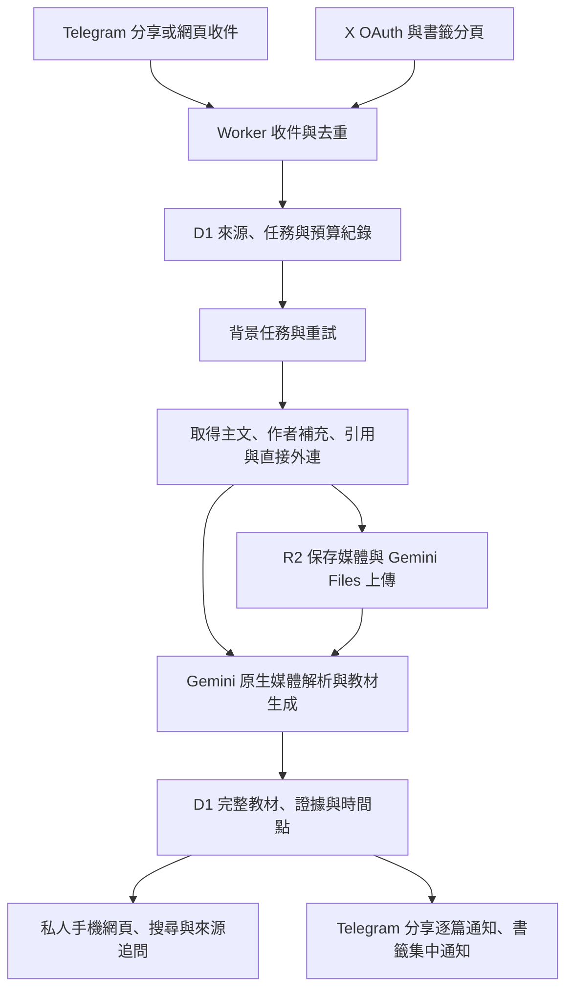

# X 收藏學習工具實作計畫

以現有 Cloudflare Worker 為入口，使用 Gemini 原生媒體輸入生成完整繁中教材。所有已接收的分享與書籤都整理，不用相關性判斷丟棄。第一版包含私人文章庫、搜尋、閱讀狀態、筆記與來源追問。

## 執行順序

1. 完成需求規格與工作拆分。需求、主要測試邊界與 8 張 tickets 已核准並發布。
2. 打通分享連結、Gemini 生成與私人文章閱讀，建立第一條可驗證流程。
3. 加入費用預留、去重、持續保存與失敗重試，讓所有後續付費入口受同一預算規則控制。
4. 完成 Telegram 收件與通知，並加入 X 授權、書籤分頁與待確認回補。
5. 擴充作者補充、父貼文、引用、直接外連、圖片與影片。保存可查核證據與缺漏狀態。
6. 完成搜尋、已讀狀態、筆記與單篇／跨文章追問。
7. 執行完整整合測試、Worker 打包與本機操作驗證，整理部署設定與少量真實 API 驗證步驟。

每個 ticket 都以可見的使用者行為驗收，不按資料庫、API、UI 等水平層拆成各自無法使用的工作。

## 架構

背景工作使用持續保存的 D1 任務，搭配 Cloudflare Queues 觸發處理。Queue 訊息只用來喚醒工作；不能因訊息到期而遺失尚未完成的任務。Cron 負責日次同步、待處理恢復、作者補充重查與媒體到期處理。

現有部落格 digest 保留原流程。X 收藏學習使用自己的來源、文章、任務與預算紀錄，避免將完整教材壓進 Telegram 字數上限，也避免把既有 digest 的篩選規則套在手動收藏上。

## 費用與停止條件

新流程月預算 US$30，先預留 Cloudflare 基本費 US$5，其餘供 X、Gemini 與儲存。既有部落格 digest 費用另計。

付費呼叫前先預留費用，回應後依資源數與 token 用量結算。未知是否已計費的失敗，保留保守預留，不以失敗為理由將成本歸零。畫面顯示的是估算與控管紀錄，不聲稱等同供應商帳單。

達門檻後暫停新付費工作。新分享仍可收件，已保存的文章仍可閱讀；待處理內容與未完成同步進度持續保存。需要使用者手動恢復，下月也不自動解除暫停。

## 主要測試邊界

沿用既有 Worker 測試方式：以真實資料表與 migration 測「收件 → 任務 → 閱讀與追問」，替換 X、Gemini、Telegram 的網路回應。另保留供應商契約測試，確認實際請求形狀、完整輸出、媒體時間點及失敗處理。

必要驗證包含：重複收件不重複生成、通知失敗不重寫文章、書籤分頁不提前停止、缺漏不冒充完整、超限媒體不截短、預算暫停不丟工作、月切換不自動恢復、跨文章回答引用可追溯。

## Tickets 與驗收狀態

8 張 tickets 已發布於本機 tracker。01–07 完成程式與模擬整合驗證；08 完成打包與本機操作驗證，真實 API 驗證仍需外部憑證。

| 編號 | 工作 | 阻擋項目 | 可驗證的完整行為 |
| --- | --- | --- | --- |
| 01 | 分享文字文章到私人文章庫 | 無 | 在網頁加入外部文章連結，Gemini 生成完整教材，登入後可讀來源與全文；重複連結重用結果 |
| 02 | 預算暫停、費用紀錄與可靠重試 | 01 | 收件、生成與重試使用同一預算；費用不足保留任務；跨月不自動恢復；使用者可手動恢復 |
| 03 | Telegram 分享收件與完成通知 | 02 | 私人 bot 接收分享，文章完成後附連結通知；重複 webhook 不重複生成；發送失敗可重送 |
| 04 | X 授權、完整書籤分頁與回補 | 02 | 連接 X，預覽既有清單並手動啟動回補；日次同步新增；同步中斷可續跑，書籤文章集中通知 |
| 05 | X 上下文、作者補充與缺漏補齊 | 04 | 保存長文、父貼文、引用、作者續寫與直接外連；缺漏醒目顯示，重試與重查後更新同一文章 |
| 06 | 圖片與影片的原生理解 | 04 | X 媒體經 R2 與 Gemini 產生可查核教材及時間點；超限保留提示，媒體到期保留解析結果 |
| 07 | 搜尋、筆記與來源追問 | 02 | 搜尋文章與來源、標記已讀及筆記，對單篇／跨文章提問並取得有效引用或證據不足回答 |
| 08 | 完整整合驗證與設定交付 | 03、05、06、07 | 全流程與既有 digest 回歸通過，完成打包與本機驗證；提供外部設定並明列真實 API 驗證結果 |

03、04、07 都在 02 完成後解除阻擋。05 與 06 不互相阻擋；文字來源補充與媒體解析可各自驗收。這些是工作相依關係，不代表必須同時派多個 agent 開發。

既有 21 個 Worker 測試已在 Node 22.19.0 通過。後續使用同一版本驗證；目前 shell 進入子目錄可能選到舊 Node，執行測試時需明確選擇符合專案要求的 Node。

## 外部驗證前置

現有 Worker 已有 RUN_TOKEN 與 Telegram 設定，尚無 Gemini 或 X 憑證。完成程式後提供設定步驟，憑證不得寫入文件、程式或聊天。

少量真實 API 驗證需檢查 X 的欄位命名、書籤排序及分頁、長文與媒體 URL，以及 Gemini 的影片輸入與用量回應。模擬測試無法證明這些外部事實。

規格見 [X 收藏學習工具](../specs/x-learning.md)。

設定與真實驗證步驟見 [設定與驗證](../learning-setup.md)。驗證證據另存於 [測試紀錄](../testing/x-learning-2026-10-10.md)。
