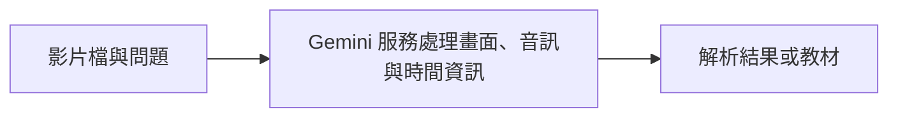
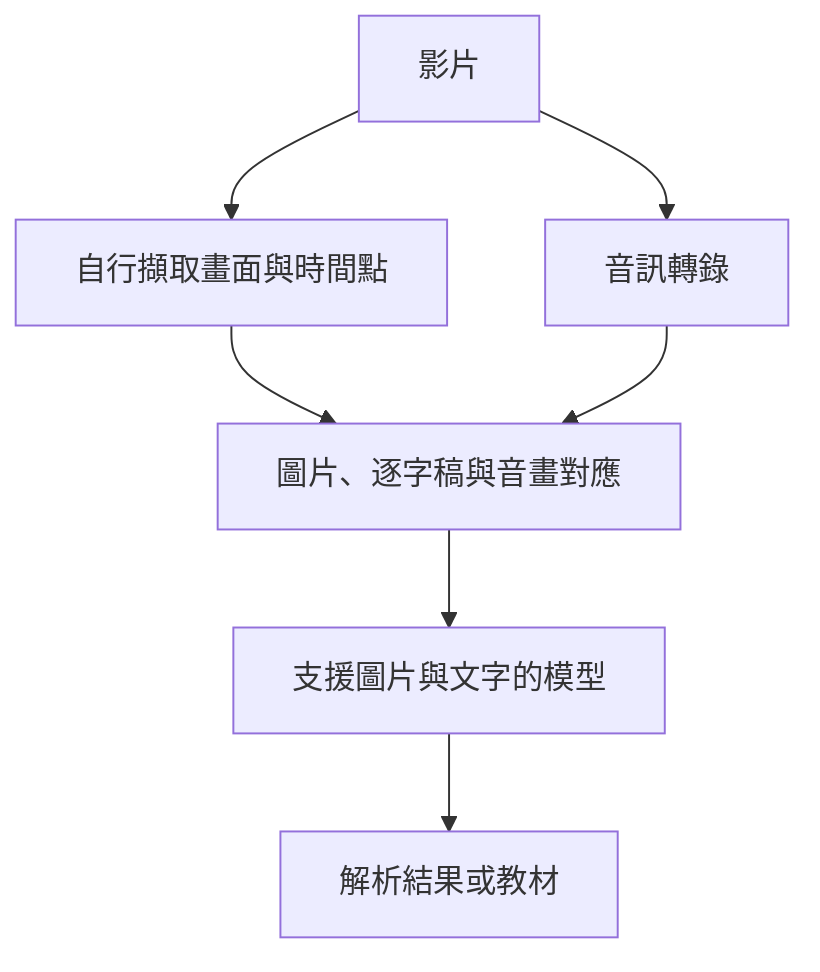

# 原生影片輸入與自行擷取畫面、轉錄音訊

兩者的目的都是理解影片，但 API 介面與處理責任不同。原生影片輸入表示服務接受影片檔，不表示模型像人一樣連續看完每一幀，也不能據此推論完整的模型內部架構。

能力查核日期：2026-10-10，Asia/Taipei。Gemini 的處理方式依官方文件；自行拆解流程的取捨是工程判斷，尚未用本專案的真實收藏實測。

## 兩種流程

### Gemini 原生影片輸入

應用程式提交影片與問題，服務負責影片前處理。開發者仍需取得來源媒體，並依需求設定取樣、解析範圍與畫面解析度。

### 自行擷取畫面與轉錄音訊

應用程式決定哪些畫面值得保留、如何轉錄音訊，以及逐字稿和圖片如何對應。模型接收的是我們準備好的素材，不會自動取得未提供的畫面。

## 實際差異

| 比較項目 | Gemini 原生影片輸入 | 自行拆解後提供給模型 |
| --- | --- | --- |
| 提供的資料 | 影片檔與問題 | 圖片、逐字稿與時間點 |
| 取樣責任 | Gemini 服務；部分參數可設定 | 應用程式自行決定 |
| 聲音資訊 | 可處理音訊與畫面 | 只提供逐字稿時，語氣與非語言聲音不會保留 |
| 音畫對齊 | 服務提供時間資訊及處理機制 | 應用程式需保存及提供對應 |
| 更換模型 | 受服務支援的影片模型限制 | 可交給支援圖片與文字的 GPT、Claude 等 |
| 證據保存 | 應另外保存原始影片與解析結果 | 可明確保存每張圖片及逐字稿；也應保留原影片 |
| 開發成本 | 串接較簡單 | 需維護取樣、轉錄、對齊與重做流程 |
| 品質邊界 | 取樣或模型理解可能漏掉細節 | 取樣、轉錄或模型理解可能漏掉細節 |

## Gemini 也會取樣

Gemini 官方文件描述兩種處理模式。

- **Static**：預設每秒取 1 張畫面，並處理音訊與時間資訊；可設定取樣頻率與片段範圍。
- **Agentic**：支援的模型依問題探索時間軸，按需求載入畫面、音訊或逐字稿。

快速動作與短暫畫面仍可能漏失。原生輸入的便利性，不等於證據一定完整。[Gemini 影片理解文件](https://ai.google.dev/gemini-api/docs/video-understanding)

## 用操作示範理解取樣問題

以下為教學假設，不是實測結果。

| 時間 | 影片內容 | 教材需要保留什麼 |
| --- | --- | --- |
| 00:18 | 講者說「打開這個選項」 | 操作目的 |
| 00:19 | 畫面顯示選項名稱 | 選項名稱與位置 |
| 00:20 | 只維持 0.3 秒的錯誤訊息 | 失敗條件與處理方式 |

若取樣沒有涵蓋錯誤訊息，模型可能只看到成功操作。這對原生取樣與自行拆解都成立。

自行拆解時，可以增加操作前後、場景切換與錯誤畫面的取樣。原生輸入也能依服務提供的參數增加取樣或重新檢查片段。哪個方案較完整，必須看實際取得的證據。

轉錄成文字還會改變聲音資訊。例如影片的提示音可能表示操作失敗，但文字逐字稿通常不會記錄它。若該聲音影響理解，需要另外保留音訊或產生可查核的音訊觀察，不能只依賴語音轉錄。

## 與單模型、雙模型的關係

影片前處理方式和模型數量是兩個獨立選擇。

| 配置 | 可以怎麼運作 |
| --- | --- |
| 原生輸入＋單模型 | Gemini 解析影片並編寫教材 |
| 原生輸入＋雙模型 | Gemini 解析，Claude 或 GPT 根據證據編寫教材 |
| 自行拆解＋單一整合模型 | 轉錄工具與取畫面流程準備證據，GPT 或 Claude 整合與寫作 |
| 自行拆解＋分開整合與寫作 | 一個模型整合媒體證據，另一個模型編寫教材 |

「單一整合模型」不代表整套流程只有一個機器學習模型；音訊轉錄工具也可能使用自己的模型。選型時應比較服務依賴、品質與總成本，不只計算模型名稱的數量。

## 在本專案的選擇

第一版採 Gemini 原生影片輸入，以減少前處理與音畫對齊的開發量。同時保存來源關係、原始媒體的可用狀態、時間點與解析結果，讓缺漏可被看見並重試。

這個選擇不是聲稱 Gemini 品質已勝過自行拆解。Mac mini 到貨後，再用相同影片比較自行取畫面與轉錄的流程，確認是否值得接管部分工作。

OpenAI 的相關輸入能力，見 [OpenAI 影片支援](2026-10-10-openai-video-support.md)。
