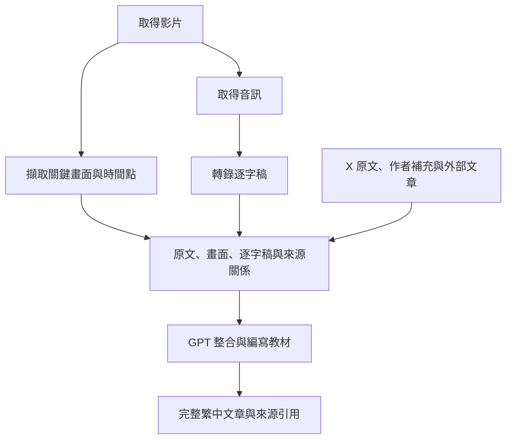

# OpenAI 如何處理影片內容

OpenAI 可以組成影片理解流程，但目前查核的主要 API 模型，採用「擷取畫面＋轉錄音訊＋模型整合」。不能直接把整段影片輸入支援圖片的 GPT，就期待它自動分析影片與聲音。

能力查核日期：2026-10-10，Asia/Taipei。本文記錄官方介面的能力快照，不是實測品質排名；模型更新後需重新查核。

## 模型支援與適用位置

| 模型 | 官方列出的輸入能力 | 在影片流程中的角色 |
| --- | --- | --- |
| GPT-6.1 Sol | 文字、圖片；音訊與影片不支援 | 整合畫面、逐字稿、原文與作者補充，編寫教材 |
| GPT-6 Astra | 文字、圖片；音訊與影片不支援 | 複雜解釋、跨來源整合與教材寫作的候選 |
| GPT-Realtime-2.1 | 文字、圖片、音訊；影片不支援 | 即時音訊互動，可由應用程式另外提供圖片 |
| GPT-Transcribe | 音訊轉錄 | 將講者說話轉成逐字稿；不分析影片畫面 |

依據：[GPT-6.1 Sol](https://developers.openai.com/api/docs/models/gpt-6.1-sol)、[GPT-6 Astra](https://developers.openai.com/api/docs/models/gpt-6-astra)、[GPT-Realtime-2.1](https://developers.openai.com/api/docs/models/gpt-realtime-2.1)、[音訊轉錄文件](https://developers.openai.com/api/docs/guides/speech-to-text)。

這個表格限定已查核的模型，不能據此推論所有未來模型。ChatGPT 產品介面與 API 的能力也要分別查核，不能由產品操作方式反推某個 API 支援影片檔。

## 自建流程如何運作

應用程式先把影片拆成圖片與音訊，再將逐字稿和圖片提供給支援視覺輸入的 GPT。圖片的時間點與逐字稿的對應時間需由應用程式保存及提供，不能期待模型自行知道影片中的位置。

音訊轉錄介面接受的格式包含 MP4，但此處處理的是語音。接受 MP4 檔案，不等於理解其中的畫面。[音訊轉錄文件](https://developers.openai.com/api/docs/guides/speech-to-text)

## 一個具體例子

以下為教學假設，不是實測結果。

講者在 00:18 說「打開這個選項」，00:19 的畫面顯示選項名稱，作者後續回覆又補充僅限某個版本。

逐字稿提供操作意圖；圖片提供選項名稱與所在位置；作者回覆提供適用條件。GPT 同時收到這些證據，才有機會把它們整理成可照著操作的教材。

若只收到逐字稿，模型沒有選項名稱的直接證據。若未取得作者回覆，即使畫面理解正確，也可能漏掉版本限制。

## 優點與邊界

這條路線可以自行決定畫面取樣、保存原始證據，也能更換最後的寫作模型。Mac mini 可以負責轉檔、抽音訊和取畫面，雲端模型負責整合與寫作。

代價是自行維護取樣與音畫對齊。兩張圖片之間的快速操作、短暫錯誤訊息或游標動作可能漏掉。只提供逐字稿時，也不會保留語氣、提示音與其他非語言聲音。

相較 Gemini 的原生影片輸入，開發者需要承擔更多前處理工作。這不表示品質必然較差；應以相同影片比較關鍵證據、操作步驟與限制是否完整。

## 在本專案的定位

第一版已選擇方案 ② 搭配 Gemini。OpenAI 保留為後續的教材寫作與拆解影片流程比較候選，沒有因為本文而新增服務依賴。

若將來採 Gemini 解析＋GPT 寫作，GPT 應收到可追溯證據，而不是只有一段 Gemini 摘要。原始媒體、原文與解析結果分別保存，才能重新查核錯誤。

原生輸入與自行拆解的比較，見 [影片輸入與前處理](2026-10-10-native-video-vs-preprocessing.md)。
