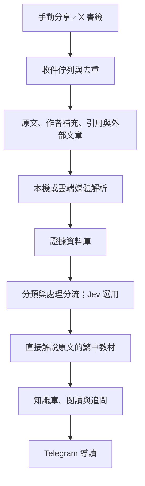

# X 收藏與技術學習工具 Survey

調查與官方文件查核日期：**2026-10-10（Asia/Taipei）**。

這是截至上述日期的評估快照，不代表後續仍有效。模型名稱、價格、產品方案、地區開放、API 權限與媒體限制，採用或付費前均須重新查核。本文沒有設定固定有效期限；新版本或計費變更即可使部分結論失效。

官方文件能力、工程估算與待實測事項分開標示。尚未用使用者實際收藏完成模型比較，也尚未驗證 Grok Bot 的書籤增量同步與輸出整合。本文描述候選方案，不代表功能已實作或部署。

## 已確定的需求與範圍

目標是每天學到最新技術，並將英文原始內容整理為可閱讀、可搜尋、可追問的繁體中文技術文章。

第一階段採用 **手動分享與 X 書籤同步**。自動追蹤公開作者、主題巡邏與登入帳號瀏覽 For You 留待後續評估。架構選擇不受現有小型專案限制。

來源涵蓋 X 的文字、圖片、影片、轉貼連結、引用貼文，以及作者在同一討論串內的續寫與補充。關注對象包含使用者提到的 Tibo、Karpathy、Claude／OpenAI 開發者帳號與員工分享；實作時須確認實際帳號，不以顯示名稱猜測。

使用者已訂購 **Mac mini M6／32 GB**，到貨後納入本機處理方案。硬體規格為使用者提供；尚未實測該機的推論速度、可用記憶體或模型執行環境相容性。

## 文章整理規則

直接解說該篇文章的目的、背景、推理、具體機制、例子、操作方式、限制與取捨。依原文深度決定篇幅與結構，不只翻譯字面或壓成固定條列摘要。

**不主動使用 iOS、UIKit、SwiftUI 或 RxSwift 概念做類比，也不因讀者的 iOS 背景而額外加入這些解釋。** 原文若本來就在討論這些技術，依原文直接解說；使用者另有明確要求時再提供類比。

使用繁體中文與台灣用語，中文與英文、數字之間留空格。術語、人名、模型與產品名稱保留原文。程式碼與數字須忠於來源。

區分原作者說法、官方文件確認的事實，以及另外補充的教學例子。來源不完整時明確標示，不用模型推測補齊。員工分享、實驗結果與個人觀察不能直接寫成正式產品承諾。

## 評估架構

| 工作 | 成功條件 | 主要難點 |
| --- | --- | --- |
| 發現內容 | 找到值得學的新資訊 | 重複、宣傳與低資訊量貼文 |
| 取得證據 | 原文、作者補充、媒體與外部連結 | X 權限與討論串完整度 |
| 理解內容 | 理解畫面、程式與操作步驟 | 逐字稿未涵蓋的視覺細節 |
| 編寫教材 | 清楚解說並保留限制 | 過度壓縮、錯誤補充與翻譯偏差 |
| 累積知識 | 搜尋、追問、筆記與複習 | 來源追溯與個人閱讀狀態 |

模型品質不能補回沒有取得的原文。先確認擷取完整度，再比較文章品質與費用。

## 內容接收與取得方式

| 方式 | 優點 | 限制／待驗證 |
| --- | --- | --- |
| 分享到 Telegram bot | 開發少，直接傳入主動選中的連結 | 分享網址不等於取得討論串與影片；後端仍需擷取 |
| 分享到自己的 iOS App | 可整合收藏、閱讀與附件接收 | Share Extension 只提供入口；閱讀、同步、搜尋仍需開發 |
| 同步 X 書籤 | 在 X 按書籤即可，保留使用者選文品味 | 需要帳號授權；確認增量同步、分頁與費用 |
| 公開作者／主題巡邏 | 不依賴個人登入狀態 | 無法保證涵蓋個人 For You 內容 |
| 官方 home timeline API | 結構化取得帳號時間序動態 | 官方描述為 reverse chronological，不能視為 For You |
| 登入瀏覽器巡邏 | 接近實際瀏覽個人推薦動態 | 登入失效、頁面改版、驗證步驟、重試與維護成本 |

官方依據：[X 書籤](https://docs.x.com/x-api/posts/bookmarks/introduction)、[X home timeline](https://docs.x.com/x-api/posts/timelines/quickstart/reverse-chron-quickstart)、[Apple Share Extension](https://developer.apple.com/library/archive/documentation/General/Conceptual/ExtensibilityPG/Share.html)。

Telegram 適合連結與輕量附件入口。官方 Bot API 的一般 getFile 下載上限為 20 MB；大影片不宜假設能直接透過這個入口處理。來源：[Telegram Bot API](https://core.telegram.org/bots/api#getfile)。

## 模型與服務候選

以下定位是依官方能力做出的工程判斷，尚未實測中文文章品質排名。

| 候選 | 建議角色 | 優點 | 限制 |
| --- | --- | --- | --- |
| xAI Grok 4.7＋X Search | 公開 X 搜尋、討論串與媒體理解 | 原生 X 搜尋、thread fetch；可開啟圖片／影片理解 | 搜尋完整度需驗證；不能假設可讀私人書籤或個人 For You |
| Gemini 3.8 Flash | 影片、音訊、圖片解析與整理 | 可直接處理影片並回答時間點問題 | 仍須先取得 X 媒體；預設取樣可能漏快速畫面 |
| Claude Sonnet 5.5／Opus 5.5 | 技術文章、跨來源整合與複雜解釋 | 文字、圖片及工具使用 | 所查模型介面以文字、圖片為主；影片須先整理成證據 |
| GPT-6.1 Sol／GPT-6 Astra | 技術解釋、結構化流程與查核 | 搜尋、工具與 computer use | GPT-6.1 Sol 模型頁明列音訊／影片輸入不支援 |
| Perplexity Search／Agent API | 補查官方文件與相關背景 | 搜尋可獨立串接自選模型 | 一般網頁搜尋不保證完整 X 討論串 |
| DeepSeek／Kimi | 分類、翻譯與文章生成的替代候選 | 可納入同一批素材比較 | 不因此具備 X 存取能力；術語與證據忠實度需測試 |
| Gemma／Qwen 開放權重模型 | 本機分類、翻譯、生成與部分媒體處理 | 可本機保存資料、自訂與部署 | 記憶體、速度、量化與長文品質需測試 |

來源：[xAI X Search](https://docs.x.ai/developers/tools/x-search)、[Gemini 影片理解](https://ai.google.dev/gemini-api/docs/video-understanding)、[Claude 模型](https://platform.claude.com/docs/en/models/overview)、[GPT-6.1 Sol](https://developers.openai.com/api/docs/models/gpt-6.1-sol)、[OpenAI 模型選擇](https://developers.openai.com/api/docs/guides/latest-model)、[Perplexity API](https://docs.perplexity.ai/docs/getting-started/pricing)、[DeepSeek API](https://api-docs.deepseek.com/quick_start/pricing/)、[Kimi API](https://platform.kimi.ai/docs/pricing/chat)、[Gemma](https://ai.google.dev/gemma/docs/core)、[Qwen3.5-9B](https://huggingface.co/Qwen/Qwen3.5-9B)。

### Grok Bot

Grok Bot 提供持續運作的雲端電腦、帳號連接、工具、記憶與排程。官方 X 整合包含貼文搜尋、timeline、mentions 與書籤工具，可評估以 routine 處理新增收藏。

它可能省掉帳號整合與工作流程開發；仍須驗證書籤分頁、增量同步、去重、作者補充完整度，以及文章匯出與 Telegram 整合。

在 X 標記 @bot 可交付貼文，但官方目前明列：貼文、被回覆或引用的貼文含影片／GIF 時不會接單。標記與確認出現在公開討論中。這是入口限制，不能推論 Grok API 沒有影片理解能力。

工作跑在雲端，Mac mini 不會降低其推論費。官方說明可透過付費 Cursor 或個人 SuperGrok 方案取得使用權，包含週用量；實際帳號方案、追加費用與 X credits 要另查。

判斷：**第一階段優先實驗候選**，不能在尚未驗證保存與同步品質前直接當作長期知識庫。

來源：[Grok Bot](https://docs.x.ai/grok-bot/overview)、[X 整合](https://x.ai/news/grok-bot-and-x)、[@bot 入口](https://docs.x.ai/grok-bot/tag-on-x)、[routines](https://docs.x.ai/grok-bot/skills-routines-and-automations)、[FAQ](https://docs.x.ai/grok-bot/faq)、[方案](https://cursor.com/help/grok-bot/plans)。

### Jev（TypeSafe AI）

Jev 是結構化判斷模型，提供 Choice、Score、Noul；接受文字或結構化文字狀態，回傳選項、評分或是非機率，部分結果附信心資訊。它不產生自由文字文章。

適合判斷主題、處理路徑、相關程度、引用是否支持主張，以及是否升級到較強模型。手動收藏已包含使用者選文意圖，第一階段優先分類與分流，不因低分自動刪除或丟棄收藏。

Jev 1.13 官方價格為 US$0.042／100 萬 input tokens，output 免費。每月 200 萬 input tokens 的判斷費約 US$0.084。只接受文字，圖片、音訊、影片須先解析。官方指出英文表現較好，其他語言需實測。

信心與機率是模型估計，需以實際素材校準；引用判斷也不能取代來源取得與人工驗證。串接輕量，但會增加服務依賴。按官方文件列入雲端服務，目前未確認有可供 Mac mini 自架的官方權重。

判斷：**選用的分類與模型分流元件**；個人少量收藏時，主要價值是處理規則清楚，大量巡邏時成本優勢較明顯。

來源：[官方介紹](https://docs.typesafe.ai/introduction)、[模型／價格／輸入限制](https://docs.typesafe.ai/models)、[confidence](https://docs.typesafe.ai/confidence)、[已知限制](https://docs.typesafe.ai/model-jaggedness/jev-1.13)。

### 現成閱讀與擷取服務

| 服務 | 可省下的工作 | 邊界 |
| --- | --- | --- |
| Readwise Reader | 收藏、閱讀、筆記與 API | 官方稱 X 整合依賴平台穩定性；完整影片教材仍需另外處理 |
| NotebookLM | 主題學習與依來源追問 | YouTube 來源匯入字幕文字，不等於完整理解畫面；新影片可能暫時無法匯入 |
| Firecrawl | 外部文章網站擷取 | 當時 X URL 經由 Grok 回傳 AI 處理資料，另計費；不能當作獨立的原文抓取管道 |

來源：[Readwise X 整合](https://docs.readwise.io/readwise/docs/importing-highlights/twitter)、[Reader API](https://readwise.io/reader_api)、[NotebookLM 來源](https://support.google.com/gemininotebook/answer/16215270?hl=en)、[Firecrawl 計費](https://docs.firecrawl.dev/billing)。

## 第一階段架構候選

| 路線 | 優點 | 主要代價 | 定位 |
| --- | --- | --- | --- |
| Grok Bot＋自己的文章庫 | 快速驗證，省掉部分串接 | 用量、同步、匯出與整合須實測 | 優先實驗 |
| 自建分享／書籤入口＋雲端模型 | 原文、紀錄與模型切換可控 | 自行開發來源處理與同步 | 穩定建置候選 |
| 自建入口＋Mac mini＋雲端補強 | 本機保存及處理，使用已購硬體 | 維護本機服務、模型與備份 | 到貨後比較 |

Mac mini 暫時離線時收件保留佇列，恢復後續處理。Grok Bot 可作為收集與執行的候選，不讓單一產品的對話紀錄成為唯一保存位置。

證據資料至少包含貼文 ID、作者、日期、回覆與引用關係、擷取狀態、媒體解析結果、時間點、外部來源與文章引用。作者續寫、作者回答他人與其他人的回覆分開保存。

重要討論串可在 24–48 小時內重查新增作者補充。相同事件的公告、示範與評論可合併整理，但保留各自來源與主張。原文／影片取得失敗時標記完整度，不推測補齊。

初期採一般資料庫、檔案保存與全文搜尋。跨文章追問需要時再加入語意檢索。多 Agent 或知識圖譜不是第一階段必要條件。

## 成本快照

### 文章生成費

假設每月 300 篇、每篇 6,000 input tokens＋2,000 output tokens；按標準短上下文價格估算。未含搜尋、媒體、重試、額外推理或其他工具。同一文章在不同 tokenizer 下的實際用量不同。

| 模型 | 每 100 萬 input／output tokens（USD） | 每月生成費估算（USD） |
| --- | --- | --- |
| Gemini 3.8 Flash | 0.75／3.75 | 3.60 |
| Grok 4.7 | 2／6 | 7.20 |
| Claude Sonnet 5.5 | 2／10 | 9.60 |
| GPT-6.1 Sol | 2／10 | 9.60 |
| Claude Opus 5.5 | 4／20 | 19.20 |
| GPT-6 Astra | 10／50 | 48.00 |

Gemini 此價格為至 2026-12-31 的優惠價；官方列出的後續價格較高。快照不代表未來報價。

來源：[Google](https://ai.google.dev/gemini-api/docs/pricing)、[xAI](https://docs.x.ai/developers/pricing)、[Claude](https://platform.claude.com/docs/en/about-claude/pricing)、[OpenAI](https://developers.openai.com/api/docs/pricing)。

### X 取得費

| 管道 | 當時官方價格 | 注意事項 |
| --- | --- | --- |
| X API 一般貼文讀取 | US$0.005／資源 | 留言、引用與其他資源另影響用量 |
| X API Owned Reads | US$0.001／資源 | 指定端點、授權使用者與 App 擁有者相同等條件；包含自己的書籤 |
| xAI X Search | US$5／1,000 篇擷取貼文 | 按貼文數而非搜尋請求數；另外計模型、媒體與 profile 等費用 |

每天一般讀取 300 篇、每月 30 天，單純貼文費約 US$45。不能只按最後生成的教材篇數估算收集成本。X API 文件當時描述同一 UTC 日內資源去重計費，但屬 soft guarantee；跨日補抓仍須考慮費用。

來源：[X API 計費](https://docs.x.com/x-api/getting-started/pricing)、[xAI 計費](https://docs.x.ai/developers/pricing)。

### 整體預算與開發工時

以下為工程估算，不是供應商報價；不含人工維護與購買硬體。候選路線有共用元件，工時不可直接相加。

| 模式 | 月費預算（USD） | 個人可用第一版工時 |
| --- | --- | --- |
| 自建手動分享＋雲端處理 | 10–35；約 300 個收藏、適量討論串與少量影片 | 5–10 人日 |
| 自建書籤同步＋簡單知識中心 | 依來源、生成量與媒體費計算 | 10–20 人日 |
| 公開巡邏 | 60–130；每日約 300 個候選，少數深度整理 | 10–20 人日 |
| 登入瀏覽器巡邏 | 30–200＋，對操作與重試量敏感 | 15–30 人日，另有持續維護 |
| 本機模型整合 | 電費、備份及必要雲端費；未量測 | 10–25 人日 |

完整 iOS 知識中心若包含 Share Extension、離線閱讀、同步、搜尋與追問，另估 15–30 人日。Grok Bot 成本按實際訂閱與用量另計，不套用自建 API 預算。

輕量後端可用 serverless；當時 Cloudflare Workers 付費方案基本月費 US$5，媒體與瀏覽器工作另計。來源：[Workers 價格](https://developers.cloudflare.com/workers/platform/pricing/)。

## Mac mini 與硬體規劃

已購硬體按額外電費、維運與品質比較，不再以重新購機回本作為主要門檻。X 存取費與外部服務費不會因本機推論消失。

| 工作 | 候選配置／安排 |
| --- | --- |
| 排程、收連結、呼叫 API | serverless 或小型主機，不需 GPU |
| 原文、附件與文章庫 | 可本機保存，另設備份與外部存取方式 |
| 影片轉檔、抽音訊、取畫面 | 優先本機；一般工作環境約 1–2 vCPU、2–4 GB RAM 起，依影片調整 |
| 搜尋、embeddings、分類與翻譯 | 納入本機候選，實測後決定 |
| 複雜技術解釋或難懂影片 | 保留雲端補強 |
| 單一瀏覽器工作 | 約 2 vCPU、4 GB RAM 起，屬工程估算；非第一階段必要 |

Gemma 4 官方 Q4 載入記憶體估算：12B 約 6.7 GB、26B A4B 約 14.4 GB、31B 約 17.5 GB。還須額外保留系統、上下文與執行環境空間；MoE 的啟用參數量不等於載入權重需求。

32 GB 到貨後先試 Gemma 4 12B Q4，再比較 26B／31B；可另加入 Qwen 等候選。載得下不代表長文處理順暢，不預先宣稱 M6 的速度。來源：[Gemma 記憶體與量化](https://ai.google.dev/gemma/docs/core)。

## 閱讀與知識保存

| 層次 | 用途 | 內容 |
| --- | --- | --- |
| Telegram 導讀 | 決定今天閱讀什麼 | 建議每日 3–5 個主題，附重要性與文章連結 |
| 技術文章 | 理解與應用 | 背景、機制、實例、限制、來源與媒體時間點 |
| 知識中心 | 累積與追問 | 原文、筆記、相關文章、已讀狀態與複習 |

後續自動發現可同時納入官方文件、engineering blog、GitHub release 與公開演講，不將來源侷限在 X。

## 驗證與重新查核條件

第一批採 30 個使用者真正想學的來源，涵蓋文字、作者續寫、圖片、影片與外部文章。比較 Grok Bot 與自建取得管道，再讓候選生成模型處理相同證據。

評估四件事：關鍵證據完整度、技術正確性、文章可讀性與可應用程度、每篇值得讀文章的實際總費用。另記錄抓取失敗、遺漏、時間與人工修正需求。Jev 以分類、分流與保留不確定案例為重點；本機模型到貨後再測速度與品質。

重新採用本 Survey 時至少查核：

- 模型版本、退役時程、模態輸入與工具支援。
- API、訂閱與媒體計費；Grok Bot 週用量、追加費用及 X credits。
- X 書籤權限、Owned Reads 條件、分頁與去重計費。
- Grok Bot X connector、@bot 地區／媒體限制、同步及匯出能力。
- Jev 價格、語言表現、輸入限制與信心校準。
- Mac mini 執行環境相容性、可用記憶體、上下文成本與實測品質。

更新調查時另存新日期快照；實測證據與維運紀錄另存，不把本文當作已驗證流程或 skill。
